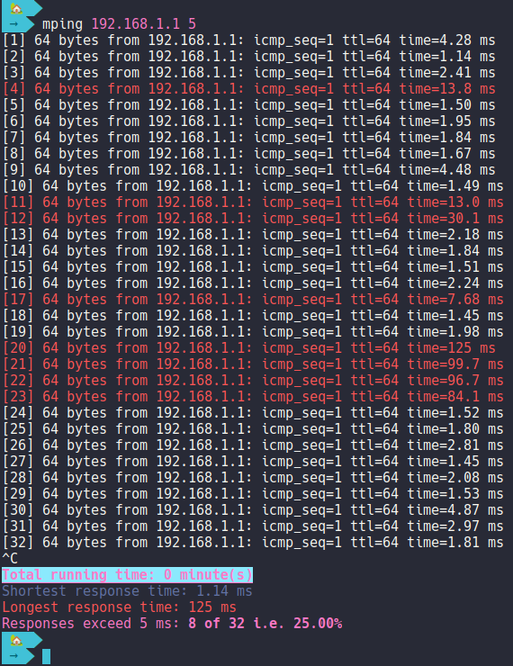

# mping
Bash script that utilize ping command with visual, audio and statistics aids.

# Usage

`mping` runs as like `ping` but it has to get an integer as second parameter which express  the minimum allowed response time in milliseconds. Any response takes more than that time, `mping` will highlight it in red color and plays `beep` command with beep sound.

After exit the command `CTRL C` a simple statistics with total run time, shortest response time, longest response time and the count of exceeded response will be printed.

```
./mping.sh 192.168.1.1 20
```
You also can copy it to /usr/bin to run it globally as a command:

```
chmod +x mping.sh

sudo cp mping.sh /usr/bin/mping
```

# About
This script has initiated using [Bing Chat](https://www.microsoft.com/en-us/edge/features/bing-chat) and I added some modifications to it.
