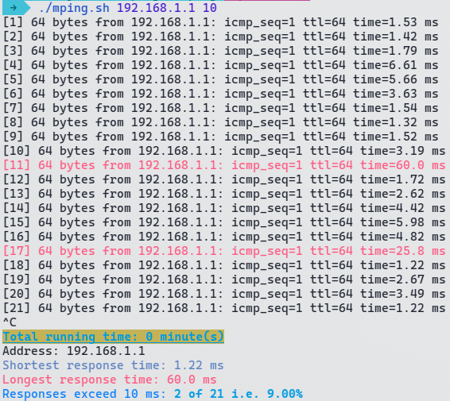

# mping
Bash script that utilize ping command with visual, audio and statistics aids.

# Usage

`mping` runs as like `ping` but it has to get an integer as second parameter which express  the minimum allowed response time in milliseconds. Any response takes more than that time, `mping` will highlight it in red color and plays `beep` command with beep sound.

After exit the command `CTRL C` a simple statistics with total run time, shortest response time, longest response time and the count of exceeded response will be printed.

```
./mping.sh 192.168.1.1 20
```
You also can copy it to /usr/bin to run it globally as a command:

```
chmod +x mping.sh

sudo cp mping.sh /usr/bin/mping
```
## Notice:
For systems that **do not support the `beep` command such as OpenSuse**. You can install the `sox` package and then use it play a mp3 file with the beep sound from a bash script named `beep` placed in `/usr/bin` directory with execution permissions. The following steps may help:

1. Install `sox` package `sudo zypper install sox`
2. Create a file named `beep.sh` with the following line `play -q beep-sound.mp3` and save the file.
3. Download any beep mp3 sound file of your choice and rename it to `beep-sound.mp3`
4. Make the bash script file executable by `chmod +x beep.sh`
5. copy the two files to `/usr/bin` by `sudo cp beep.sh /usr/bin/beep` *note, we removed the extension from* `beep.sh` and `sudo cp beep-sound.mp3 /usr/bin/beep-sound.mp3`

Now the beep command inside the script will be emulated using the script we have done above.

# About
This script has initiated using [Bing Chat](https://www.microsoft.com/en-us/edge/features/bing-chat) and I added some modifications to it.
